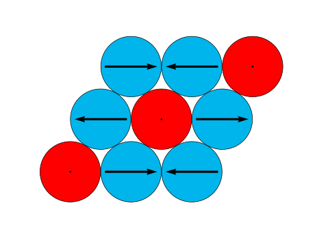
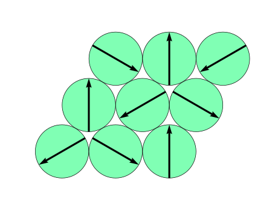

Python reference implementation of Anderson towers construction algorithm proposed in research paper [arXiv:2210.03922](https://arxiv.org/abs/2210.03922).

## Prerequisites
We use [Qiskit](https://qiskit.org) framework to build coherent state from classical magnetic moments. We also utilize [h5py](https://docs.h5py.org/en/stable/) for HDF5 files manipulation, [Numpy](https://numpy.org) and [Matplotlib](https://matplotlib.org). It is possible to install the dependencies with `pip` python package manager:
```sh
pip install qiskit numpy h5py matplotlib
```

## Installation
There is no need to install anything from this repository. 
One can simply clone this repository and use python or shell scripts:
```sh
git clone git@github.com:omsotnikov/anderson-towers-construction.git
```

## Usage
The repository contains six python scripts, data files and the shell script building Anderson tower of states for classical Néel ordering on 3x3 triangular lattice.
Each python script takes a number of parameters with command line.
You can invoke any script with `--help` key to see short description of these parameters. 
```sh
python3 ./minimize_overlap.py --help
```
Alternatively, you can inspect [optimize.sh](./example/optimize.sh) shell script for example of python scripts usage. 
Execution of this script will perform minimization of overlap error between approximation and target coherent state.
We encourage the user to start with this script.

Although this repository contains pure python reference implementation of the approach, which is not the best in terms of performance, one can use these scripts to build towers for arbitrary states.
For that purpose the user should provide a set of eigenvectors and eigenvalues, which can be easily obtained with [SpinED](https://github.com/twesterhout/spin-ed) exact diagonalization package or any other ED solver, and target classical magnetic configuration.

Below we will describe each file in details.

### Data files
We prepared two classical Néel orderings on triangular lattice (see [paper](https://arxiv.org/abs/2210.03922)):

<p align="center">
  
  
</p>

which are written in [triangular3x3.classic_spins.h5](./example/triangular3x3.classic_spins.h5) and [triangular3x3.xy.classic_spins.h5](./example/triangular3x3.xy.classic_spins.h5) correspondingly.
These files are used by [minimize_overlap.py](./minimize_overlap.py) to calculate coherent quantum state corresponding to these classical orderings. 
Another file used by this script is [triangular3x3.eigenvectors.h5](./example/triangular3x3.eigenvectors.h5) which contains eigenvectors and eigenvalues of corresponding quantum model needed for Anderson tower construction. The [triangular3x3.coordinates.h5](./example/triangular3x3.coordinates.h5) file contains only coordinates of 3x3 triangular lattice and used for classical ordering reconstruction of approximation.

### Optimization script
Script [minimize_overlap.py](./minimize_overlap.py) performs approximation of target state with Anderson tower by means of gradient descent and takes the following arguments:
- `spins` - path to hdf5 file with classical magnetic moments to prepare coherent state;
- `eigenvectors` - path to hdf5 file with eigenvectors of quantum model used for Anderson tower construction;
- `--states` - number of low lying energy levels which statevectors will be used for Anderson tower;
- `--steps` - number of gradient descent steps to perform;
- `--gamma` - size of gradient descent step;
- `--delta` - finite difference derivatives approximation step;
- `--start` - starting coefficients of superposition (for e.g. from previous run);
- `--tolerance` - precision for floating point comparison;
- `--root` - root of eigenvalues and eigenvectors datasets in hdf5 file.

This script outputs two files: `statevector_approximation.h5` and `coefficients.h5` which contain approximate statevector and coefficients of superposition, respectively.
This script imports `OverlapOptimizer` class from [overlap_optimizer.py](./overlap_optimizer.py) and a number of functions from [overlap_functions.py](./overlap_functions.py), so keep them in the same folder with [minimize_overlap.py](./minimize_overlap.py) or be sure that folder containing these scripts is present in `PYTHONPATH`.

### Auxiliary scripts

The [reconstruct_classic.py](./reconstruct_classic.py) and [draw_spins.py](./draw_spins.py) scripts are used to measure magnetic moment components in approximate statevector and drawing the result, respectively. In order to print evolution of error function one can use [print_error_function.py](./print_error_function.py) script.
